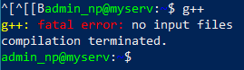
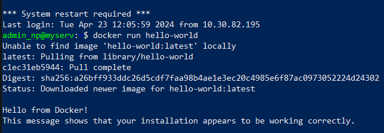

# Dokumentacja projektowa
| Błażej Drozd | Maciej Michalak   |
|--------------|-------------------|

## Konfiguracja serwera
### Login i hasło
- MySQL
  - root
  - 7bF4u9o9rcGxCwq
- Ubuntu Server
  - admin_np
  - P@s$w0
### Instalacja serwera ssh
- Przy instalacji Ubuntu Server zaznaczyliśmy opcję automatycznej instalacji serwera SSH.
### Instalacja interpretera Python
Python został zainstalowany automatycznie wraz z systemem Ubuntu Server. Nie instalowaliśmy go ręcznie.

### Instalacja kompilatora C/C++
```sh
sudo apt install g++
```


### Instalacja dockera
```sh
sudo apt-get update
sudo apt-get install ca-certificates curl
sudo install -m 0755 -d /etc/apt/keyrings
sudo curl -fsSL https://download.docker.com/linux/ubuntu/gpg -o /etc/apt/keyrings/docker.asc
sudo chmod a+r /etc/apt/keyrings/docker.asc

echo \
  "deb [arch=$(dpkg --print-architecture) signed-by=/etc/apt/keyrings/docker.asc] https://download.docker.com/linux/ubuntu \
  $(. /etc/os-release && echo "$VERSION_CODENAME") stable" | \
  sudo tee /etc/apt/sources.list.d/docker.list > /dev/null
sudo apt-get update

sudo apt-get install docker-ce docker-ce-cli containerd.io docker-buildx-plugin docker-compose-plugin

sudo groupadd docker
sudo usermod -aG docker $USER
docker run hello-world
```


[Dokumentacja dockera dotycząca instalacja](https://docs.docker.com/engine/install/ubuntu/)

[Dokumentacja dockera dotycząca dodawania użytkonika do grupy dockera](https://docs.docker.com/engine/install/linux-postinstall/)

### Instalacja mDNS (avahi-daemon)
```sh
sudo apt update
sudo apt install avahi-daemon
```