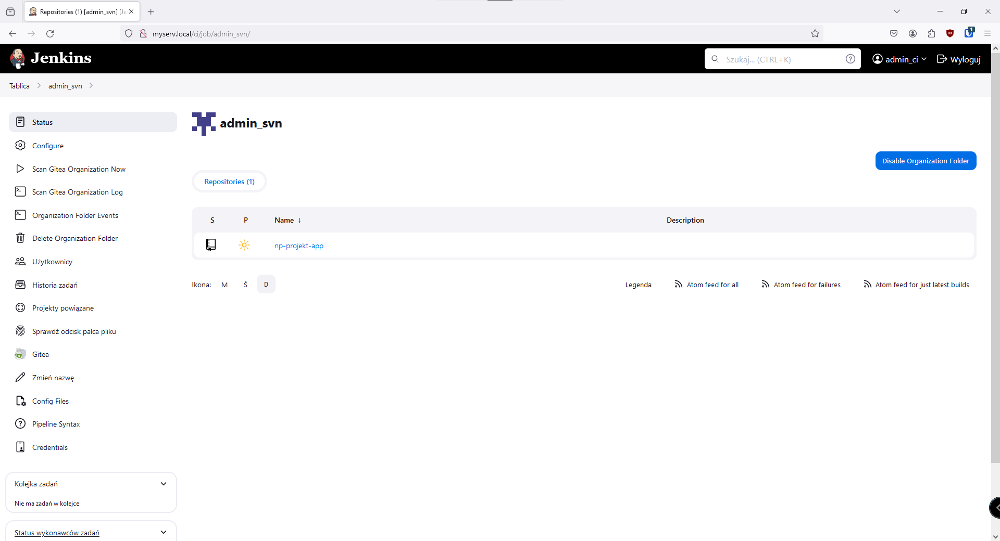
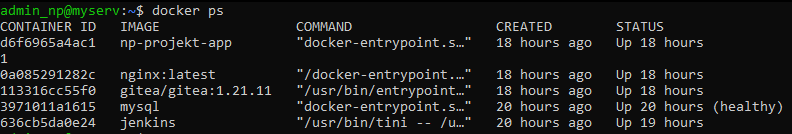

<table>
<thead>
  <tr>
    <th>Dokumentacja projektowa</th>
    <th colspan="2"></th>
  </tr>
</thead>
<tbody>
  <tr>
    <td>Opracowali:</td>
    <td>Błażej Drozd<br></td>
    <td>Maciej Michalak</td>
  </tr>
</tbody>
</table>

### Loginy i hasła
- Ubuntu Server
  - admin_np
  - P@s$w0
- SVN (Gitea)
  - admin_svn
  - P@s$gH
- Jenkins
  - admin_ci
  - P@s$c1
- MySQL
  - root
  - 7bF4u9o9rcGxCwqs


## Konfiguracja serwera

### Instalacja serwera ssh

- Przy instalacji Ubuntu Server zaznaczyliśmy opcję automatycznej instalacji 
serwera SSH.

### Instalacja interpretera Python

- Python został zainstalowany automatycznie wraz z systemem Ubuntu Server. Nie instalowaliśmy go ręcznie.

### Instalacja kompilatora C/C++

```sh
sudo apt install g++
```


### Instalacja dockera

```{.bash .wrap}
sudo apt-get update
sudo apt-get install ca-certificates curl
sudo install -m 0755 -d /etc/apt/keyrings
sudo curl -fsSL https://download.docker.com/linux/ubuntu/gpg -o /etc/apt/keyrings/docker.asc
sudo chmod a+r /etc/apt/keyrings/docker.asc

echo \
  "deb [arch=$(dpkg --print-architecture) signed-by=/etc/apt/keyrings/docker.asc] https://download.docker.com/linux/ubuntu \
  $(. /etc/os-release && echo "$VERSION_CODENAME") stable" | \
  sudo tee /etc/apt/sources.list.d/docker.list > /dev/null
sudo apt-get update

sudo apt-get install docker-ce docker-ce-cli containerd.io docker-buildx-plugin docker-compose-plugin

sudo groupadd docker
sudo usermod -aG docker $USER
docker run hello-world
```


[Dokumentacja dockera dotycząca instalacja](https://docs.docker.com/engine/install/ubuntu/)

[Dokumentacja dockera dotycząca dodawania użytkownika do grupy dockera](https://docs.docker.com/engine/install/linux-postinstall/)

### Instalacja mDNS (avahi-daemon)

```sh
sudo apt update
sudo apt install avahi-daemon
```
Dzięki instalacji avahi można łączyć się z serwerem za pomocą adresu myserv.local.

## Dalsza część projektu

Cała reszta projektu jest niezależna od serwera i można ją uruchomić wszędzie tam gdzie jest tylko docker.

### Opis plików dockera

#### docker-compose.app_dev.yml

To plik, którego używaliśmy podczas tworzenia i testowania aplikacji, jest on integralną częścią pliku .devcontainer.json. Dzięki temu w Visual Studio Code tworzyło się gotowe środowisko w postaci kontenera (dodatek Dev Containers). To znacząco ułatwiło współpracę i przyspieszyło proces twórczy.

#### np-projekt-app/Dockerfile.dev

Plik buduje obraz dockera naszej aplikacji w trybie developerskim, obraz jest przystosowany tylko do testowania, nie jest to wersja ostateczna.

#### np-projekt-app/Dockerfile

To tzw. "produkcyjny" plik Docker, stawia naszą aplikację w trybie produkcyjnym, odpowiednio przygotowuje bazę danych itp.

Aplikacja zbudowana z tego pliku jest odpowiednio zoptymalizowana i gotowa do użytku przez użytkownika.

#### np-projekt-app/docker-compose.yml

To gotowy plik docker compose używany do budowania aplikacji w Jenkins. 

#### docker-compose.server_dev.yml

Plik Docker compose z naszą "infrastrukturą" serwerową. Jest tutaj postawiony Jenkins, Gitea oraz Nginx czyli 

#### Dockerfile.jenkins

Aby uruchomić aplikację za pomocą Jenkinsa trzeba zainstalować w nim Dockera oraz docker-compose. Za pomocą tego pliku Dockera, tworzymy customowy obraz Jenkinsa z zainstalowanym cli dockera oraz docker compose.

### Konfiguracja narzędzi

#### Gitea

Jako system kontroli wersji użyliśmy Gitea. Jest bardzo łatwa w konfiguracji i niesamowicie lekka - np. w porównaniu z Gitlab.

Sama konfiguracja jest umieszczona w pliku Docker Compose, po otworzeniu Gitea w przeglądarce musieliśmy tylko zarejestrować użytkownika, dane do logowania są podane na początku dokumentacji.


#### Jenkins

Wybraliśmy Jenkinsa jako narzędzie do automatyzacji ze względu na łatwość integracji z Gitea.

Najpierw trzeba było połączyć Jenkinsa z Gitea, instalując plugin Gitea oraz dodać organizację. Dodatkowo należało dodać dane logowania do Gitea w zakładce Credentials.

***Ważne: w zakłace Credentials należy również podać zawartość dwóch zmiennych środowiskowych potrzebnych do działania aplikacji, o czym będzie później.***



Jenkins samoistnie wykrył repozytorium i zaczął je automatycznie budować za pomocą pliku Jenkinsfile. Co oczywiście się nie udało, ponieważ w tamtej chwili Jenkinsfile był w trakcie budowy i posiadał kilka błędów.

Krótko po tym pojawił się kolejny problem, skoro Jenkins jest uruchomiony w Dockerze, a nasza aplikacja też wymaga Dockera, to powstaje swego rodzaju zagnieżdżenie, trzeba by było uruchomić Dockera w Dockerze, co nie powinno mieć miejsca.

W ramach rozwiązania tego problemu, przekazujemy Dockera z maszyny hosta do kontenera Jenkinsa za pomocą wolumenu
```yaml
volumes:
      # Aby uchronić się przed uruchamianiem Dockera w Dockerze, przekazujemy
      # za pomocą wolumenu socket dockera z hosta do instancji Jenkinsa.
      - /var/run/docker.sock:/var/run/docker.sock
```
Przez to Jenkins uruchamia kontenery Dockera na maszynie hosta.

Jak widać aplikacja oraz baza danych MySQL działa na tej samej maszynie co Jenkins, Gitea oraz Nginx.


Po przejściu przez konfigurację Jenkins bez problemu wykonuje wszystkie wymagane przez nas kroki.


Wykonanie zadań przez Jenkinsa jest również widoczne w Gitea jako symbol zielonej strzałki obok nazwy ostatniego commita.

#### Nginx

Konfiguracja Nginx przebiegła niezwykle łatwo przez mnogość przykładów dostępnych online oraz bardzo przyjemną dokumentację. Proces instalacji oczywiście jak wcześniej pomijamy, ponieważ jest on elementem naszego pliku Docker Compose.

Trochę niezrozumiałe było w jaki sposób mielibyśmy robić reverse proxy za pomocą domeny myserv, która nie była nigdzie rozgłaszana w sieci, a do tego jeszcze z użyciem subdomen. Trochę zmieniliśmy podejście do tego tematu, oczywiście unikając stawiania własnego serwera DNS.

Do projektu dołączyliśmy tzw. mDNS czyli program avahi. Dzięki temu w dowolnej sieci, do której jest podłączony serwer jest rozgłaszana domena myserv.local, która kieruje do jego adresu IP. Wadą tego rozwiązania jest to, że nie są obsługiwane subdomeny czyli np. svn.myserv.local. Dlatego zamiast subdomen użyliśmy ścieżek.

Aby połączyć się z danymi narzędziami należy użyć adresów:

- http://myserv.local/ - aplikacja Article App
- http://myserv.local/svn - Gitea
- http://myserv.local/ci - Jenkins

Można też użyć adresu ip serwera, w razie gdyby mDNS nie działał. Przykładowo

- http://192.168.8.8/
- http://192.168.8.8/svn
- http://192.168.8.8/ci

Jeśli chodzi o reverse proxy bazy danych nie widzieliśmy sensu tego robić, skoro aplikacja i tak musi łączyć się z bazą danych bez udziału Nginx.

W każdym razie, Nginx jest tutaj używany w zasadzie prawie tak samo jak w rozwiązaniu z subdomenami i działa prawidłowo.

#### MySQL

MySQL jest elementem aplikacji, nie łączyliśmy się z bazą danych ręcznie ani razu. Wszystkie zadania związane z zarządzaniem bazą danych wykonuje ORM Prisma przy starcie aplikacji.